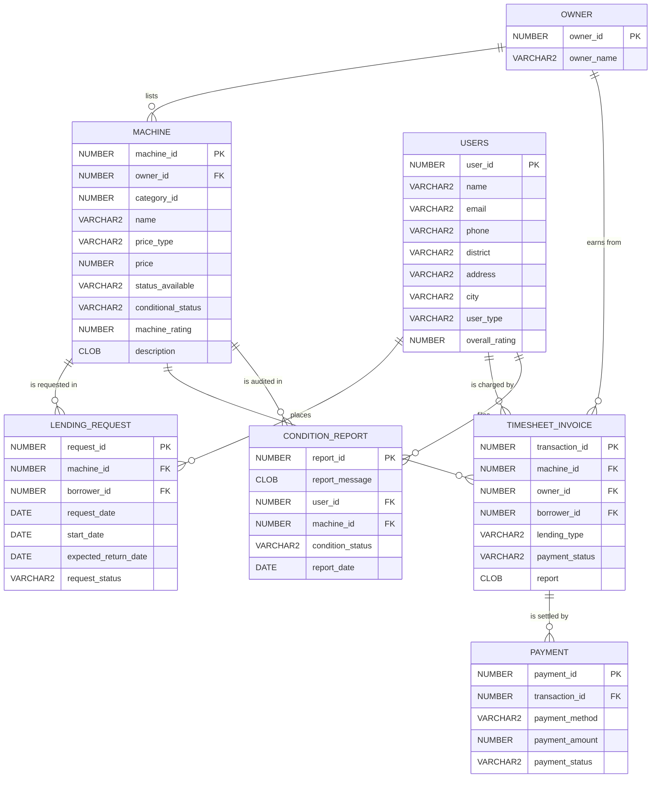

<div align="center">

# 🏗️ Oracle-SQL-JDBC-Lending-Hub

**Community Lending Platform — a complete Oracle database stack, from relational schema design to PL/SQL business logic to a Java Swing/JDBC desktop client.**

[](01-schema)
[](04-plsql)
[](06-java-gui)
[](06-java-gui)
[](LICENSE)
[](02-queries)

</div>

---

## 📖 Overview

The **Community Lending Platform** is a peer-to-peer equipment-rental hub: equipment **owners** list machines, registered **borrowers** place lending requests, fulfilled requests become **timesheet invoices**, invoices are settled through **payments**, and returned machinery is audited via **condition reports**.

This repository restructures a raw Oracle lab-log dump into a **publication-ready engineering artifact**. Every prompt artifact (`SQL>`, `Table created.`, `ORA-` noise, spool markers) has been stripped; every script is re-runnable, carries a header block documenting *objective, relational concept, logic breakdown and expected I/O*, and executes against one coherent seed dataset.

> **Dataset note:** the original lab printouts were captured mid-build, so row counts grew between exercises. All documentation in this repo reflects the **final seed dataset** (`01-schema/03_seed_data.sql`); where the historical log differed, the file header says so explicitly.

---

## 🗂 Repository Map

```
Oracle-SQL-JDBC-Lending-Hub/
├── README.md
├── LICENSE
├── 01-schema/                    -- DDL + referential integrity + seed data
│   ├── 01_create_tables.sql      --   7 entities, named PKs, CLOB/DATE typing
│   ├── 02_add_constraints.sql    --   9 named FKs (ALTER TABLE pattern)
│   └── 03_seed_data.sql          --   53 coherent rows incl. "orphan" edge rows
├── 02-queries/                   -- Declarative SQL: selection → correlation
│   ├── 01_selection_filters.sql  --   WHERE / projection / date predicates
│   ├── 02_aggregate_functions.sql--   COUNT, AVG, MAX, SUM, GROUP BY rollups
│   ├── 03_joins.sql              --   INNER/LEFT/RIGHT/FULL/SELF/CROSS catalog
│   ├── 04_set_operators.sql      --   UNION, INTERSECT, MINUS + RI spot-check
│   ├── 05_subqueries.sql         --   scalar, IN/NOT IN, ALL/ANY quantifiers
│   └── 06_correlated_and_cte.sql --   correlated filters, inline views, WITH
├── 03-views-indexes/
│   ├── 01_indexes.sql            -- B-tree, UNIQUE, DESC-key + USER_INDEXES
│   └── 02_views.sql              -- 10 view patterns incl. CHECK OPTION,
│                                    READ ONLY, expression & join views
├── 04-plsql/                     -- Procedural layer
│   ├── 01_cursor_procedures.sql  -- implicit / explicit / parametric cursors
│   ├── 02_exception_handling.sql -- TOO_MANY_ROWS, INVALID_CURSOR, user-defined
│   ├── 03_functions.sql          -- scalar, SYS_REFCURSOR, parametric fns
│   └── 04_procedures_dml_out_params.sql -- action dispatcher, OUT / IN OUT
├── 05-triggers/                  -- Row-level event engine
│   ├── 01_validation_triggers.sql-- rating band, owner existence, payment > 0
│   ├── 02_audit_triggers.sql     -- AFTER/BEFORE on INSERT/UPDATE/DELETE
│   ├── 03_instead_of_trigger.sql -- writing through a non-updatable view
│   └── 04_payment_sync_trigger.sql-- payment → invoice state propagation
└── 06-java-gui/
    ├── LendingPlatform.java      -- Swing client, bind-variable CRUD, env config
    └── items_table.sql           -- ITEMS catalog table the app CRUDs against
```

---

## 🧬 Logical Data Model



### 📋 Table Schemas (quick reference)

| Table | Primary Key | Foreign Keys | Notable Columns |
|---|---|---|---|
| `USERS` | `user_id` | — (referenced by 3 children) | `email` (unique via index), `overall_rating NUMBER(3,2)` |
| `OWNER` | `owner_id` | — | `owner_name` |
| `MACHINE` | `machine_id` | `owner_id → OWNER` (nullable) | `price NUMBER(10,2)`, `description CLOB` |
| `LENDING_REQUEST` | `request_id` | `machine_id → MACHINE`, `borrower_id → USERS` | 3 `DATE` columns, `request_status` |
| `TIMESHEET_INVOICE` | `transaction_id` | `machine_id`, `owner_id`, `borrower_id` | `lending_type` (Rent/Lease), `report CLOB` |
| `PAYMENT` | `payment_id` | `transaction_id → TIMESHEET_INVOICE` | `payment_method`, `payment_amount` |
| `CONDITION_REPORT` | `report_id` | `user_id → USERS`, `machine_id → MACHINE` | `report_message CLOB`, `report_date` |

**Seed snapshot:** 9 users • 5 owners • 8 machines • 8 requests • 8 invoices • 8 payments • 7 reports — including *deliberate orphan rows* (machine 8 ownerless, request 99 unmatched, invoice 8 unlinked, report 7 unattributed) that power the OUTER-join demonstrations.

---

## 🚀 Quick Start

### Database layer (SQL*Plus / SQLcl / SQL Developer)

```sql
-- 1. Build the schema & populate it
@01-schema/01_create_tables.sql
@01-schema/02_add_constraints.sql
@01-schema/03_seed_data.sql

-- 2. Explore query modules (any order)
@02-queries/03_joins.sql

-- 3. Physical design objects
@03-views-indexes/01_indexes.sql
@03-views-indexes/02_views.sql

-- 4. Procedural layer
@04-plsql/01_cursor_procedures.sql
@04-plsql/02_exception_handling.sql
@04-plsql/03_functions.sql
@04-plsql/04_procedures_dml_out_params.sql

-- 5. Event engine (validation + audit + INSTEAD OF + sync)
@05-triggers/01_validation_triggers.sql
@05-triggers/02_audit_triggers.sql
@05-triggers/03_instead_of_trigger.sql
@05-triggers/04_payment_sync_trigger.sql
```

### Java client

```bash
sqlplus lending_app/<password>@//localhost:1521/XEPDB1 @06-java-gui/items_table.sql
export DB_URL="jdbc:oracle:thin:@//localhost:1521/XEPDB1"
export DB_USER="LENDING_APP"
export DB_PASSWORD="<password>"
javac 06-java-gui/LendingPlatform.java
java -cp .:06-java-gui:ojdbc11.jar LendingPlatform
```

---

## 🔍 Deep Dives

<details>
<summary><b>01 — Schema & Referential Integrity</b> · named constraints, Oracle typing lessons</summary>

- **Named PKs/FKs** (`pk_users`, `fk_machine_owner`, …) turn an unreadable `ORA-02291 (... SYS_C008348)` into a self-describing `FK_MACHINE_OWNER violated`.
- The raw log hit **`ORA-00902` twice** by using `TEXT`/`VARCHAR`/`DECIMAL`; the sanitized schema maps them to `CLOB`/`VARCHAR2`/`NUMBER(p,s)`.
- FK columns are intentionally **nullable** — that is what lets the seed express an unassigned machine, an unmatched request and an orphan invoice for OUTER-join pedagogy.
- No `ON DELETE` clause → Oracle default **NO ACTION** protects parents from deletion while children exist.

</details>

<details>
<summary><b>02 — Core Queries</b> · filters, aggregates, set algebra</summary>

- **Selection/Projection** (`01_selection_filters.sql`): equality, range, status-flag and ANSI-`DATE` temporal predicates — calendar-safe regardless of `NLS_DATE_FORMAT`.
- **Aggregates** (`02_aggregate_functions.sql`): `AVG(price)` *after* a `WHERE` pre-filter vs `GROUP BY` partitions; `LEFT JOIN + COUNT(fk)` keeps **zero-count** borrowers/machines visible (Vikram Singh → 0, Excavator → 0).
- **Set operators** (`04_set_operators.sql`): `UNION` merges borrowers+owners into one contact directory; `INTERSECT` finds machines both *requested* and *condition-reported* `{1,2,3,4,6}`; `MINUS` isolates borrowers who never filed a report → `{6}` (Divya Nair). A bonus `MINUS` double-check performs a **declarative referential-integrity spot-check**.

</details>

<details>
<summary><b>02 — Join Catalog</b> · all six join flavours against one dataset</summary>

`03_joins.sql` is the heart of the module. Same FK graph, six semantics:

| Query | Flavour | Business answer | Row count |
|---|---|---|---|
| Q1–Q2 | `INNER` | catalog card, request → machine+price | 1 / 7 |
| Q3–Q4 | `LEFT` | settlement ledger; idle borrowers stay visible | 8 / 9 |
| Q5–Q8 | `RIGHT` | symmetry demo; **Global Rent Corp** appears despite listing nothing | 8–9 |
| Q9–Q12 | `FULL OUTER` | orphans on *both* sides (Vikram/Anjali + request 99 + report 7) | 8–10 |
| Q13 | `SELF` | same-district borrower pairs; `u1.id < u2.id` kills reflexive+mirror rows | 7 |
| Q14 | `CROSS` | Cartesian capacity matrix (72 rows) — flagged with danger notes | 72 |

</details>

<details>
<summary><b>02 — Subqueries, Correlation & CTEs</b> · pushing logic into the query</summary>

- **Scalar subqueries** supply *computed* thresholds: fleet average (`8274.38`), max payment (`50000`), min price (`50`).
- **Quantified comparison pitfalls are demonstrated live:** owner 5 owns nothing, so `price > ALL (…)` is *vacuously true* for all 8 machines while `price < ALL (…)` returns zero rows — the empty-set duality most students meet only in exams.
- **Correlated subquery**: premium-per-owner analysis (`06_correlated_and_cte.sql`) — inner `AVG` re-evaluated per outer row → Power Hammer 650, Welding Machine 120, Excavator 12000.
- **CTE rewrite**: the same question asked with `WITH avg_price AS (…)` proves semantic equivalence with better readability and a single aggregate pass.

</details>

<details>
<summary><b>03 — Views & Indexes</b> · virtual tables, guard rails, access paths</summary>

**Views (`02_views.sql`)** — ten patterns, each with a teaching output:

| View | Pattern | Guard rail / output |
|---|---|---|
| `machine_alias_view` | header aliases | `MID / MACHINE_NAME / PRICE` |
| `expensive_machine_view` | row filter `price > 5000` | Tower Crane, Excavator |
| `available_machine_view` | **`WITH CHECK OPTION`** | UPDATE hiding a row → `ORA-01402` |
| `readonly_machine_view` | **`WITH READ ONLY`** | any DML → `ORA-42399` |
| `total_machine_price_view` | aggregate | `66,195` |
| `machine_owner_view` | join | 7 rows (ownerless machine excluded) |
| `distinct_owner_view` | `DISTINCT` | `{1,2,3,4,NULL}` |
| `machine_price_service_view` | expression col | `price * 1.10` |
| `owner_machine_count_view` | `GROUP BY` rollup | per-owner fleet size |
| `owner_name_view` | **NOT NULL restriction** | insert missing PK → `ORA-01400` |

**Indexes (`01_indexes.sql`)**: B-tree on `machine(name)`, **`UNIQUE` on `users(email)`** (enforces the alternate key — duplicates raise `ORA-00001`), and a **descending-key** index on `machine(price DESC)`, all observable through `USER_INDEXES`.

</details>

<details>
<summary><b>04 — PL/SQL Cursor Discipline</b> · implicit → explicit → parametric</summary>

`01_cursor_procedures.sql` walks the full maturity ladder. The **parametric cursor** is the centerpiece:

```sql
CURSOR c_req (uid NUMBER) IS
   SELECT request_status FROM lending_request WHERE borrower_id = uid;
...
FOR u IN (SELECT user_id, name FROM users ORDER BY user_id) LOOP
   FOR r IN c_req (u.user_id) LOOP      -- cursor re-binds for EVERY user
      DBMS_OUTPUT.PUT_LINE('  Status: ' || r.request_status);
   END LOOP;
END LOOP;
```

- The inner loop's `WHERE` clause is rebound per outer row — PL/SQL's answer to a correlated subquery, reusable anywhere in the block.
- `user_machine_status` shows the 3-table cursor with **aliased select list** (avoiding the duplicate `name` column trap).
- Anchored declarations (`%TYPE`, `%ROWTYPE`) keep the code refactor-proof.

</details>

<details>
<summary><b>04 — Exception Engineering</b> · predefined → runtime → user-defined</summary>

`02_exception_handling.sql` demonstrates three levels, all *trapped* so the engine keeps running:

| Demo | Trigger | Oracle signal |
|---|---|---|
| `test_exception` | `SELECT INTO` over 9 borrowers | `ORA-01422 TOO_MANY_ROWS` |
| `invalid_cursor_demo` | `FETCH` after `CLOSE` | `ORA-01001 INVALID_CURSOR` |
| `check_price` | price < 100 floor (Electric Drill trips it) | custom `low_price` exception |

`03_functions.sql` completes the read-path arsenal: scalar function callable from SQL (`pricing(machine_id)`), a **`SYS_REFCURSOR`-returning function** (`owner_mac`) delivering live result sets, and a parametric-cursor counter (`count_by`). `04_procedures_dml_out_params.sql` covers the write path: an action-dispatched DML governor plus **`OUT`** and **`IN OUT`** parameter contracts.

</details>

<details>
<summary><b>05 — Trigger Engine</b> · validation, audit, INSTEAD OF, state sync</summary>

**Validation (`01_validation_triggers.sql`)** — deterministic app errors in the `-20000s` band:

| Trigger | Timing | Rule | Veto |
|---|---|---|---|
| `trg_machine_rating_chk` | BEFORE INSERT ON `machine` | rating ∈ [0,5] | `ORA-20001` |
| `trg_machine_owner_chk` | BEFORE INSERT ON `machine` | owner must exist (NULLs allowed) | `ORA-20003` |
| `trg_payment_amount_chk` | BEFORE INSERT ON `payment` | amount > 0 | `ORA-20004` |

**Audit (`02_audit_triggers.sql`)** — `:OLD` vs `:NEW` narration across INSERT/UPDATE/DELETE, including the column-scoped `AFTER UPDATE OF request_status` ("Old: Pending New: Completed") and the conditional downgrade detector.

**INSTEAD OF (`03_instead_of_trigger.sql`)** — the flagship concept:

```sql
CREATE OR REPLACE TRIGGER trg_instead_insert_view
INSTEAD OF INSERT ON usermachineview     -- cartesian view = non-updatable
FOR EACH ROW
BEGIN
   INSERT INTO users (user_id, name)
   VALUES (:NEW.user_id, :NEW.user_name);  -- routed to the right base table
END;
```

The client inserts *into the view*; the trigger substitutes targeted base-table DML. **State sync (`04_payment_sync_trigger.sql`)** keeps `timesheet_invoice.payment_status` in lockstep with `payment` — and it's legal precisely because the mutating-table rule (`ORA-04091`) only restricts the trigger's *own* table. Every demo battery ends in `ROLLBACK` so seed data stays pristine.

</details>

<details>
<summary><b>06 — Java Swing + JDBC Client</b> · bind-variable CRUD, sanitized config</summary>

`LendingPlatform.java` is a compact desktop catalog manager:

- **Security hardening applied**: the raw lab file hard-coded `jdbc:mysql://…`, user and a live password. The sanitized build reads `DB_URL` / `DB_USER` / `DB_PASSWORD` from the environment and defaults to the Oracle thin driver.
- **Injection-proof**: all four operations use `PreparedStatement` bind variables (`INSERT INTO ITEMS VALUES (?,?,?,?)`, `UPDATE … WHERE ITEM_ID=?`, `DELETE … WHERE ITEM_ID=?`).
- **Row-count UX**: `executeUpdate()` returning `0` drives the *"Item ID not found!"* dialog; `executeQuery()` streams the catalog into a scrollable `JTextArea`.
- **Hygiene**: try-with-resources on every statement/result set, `con.close()` on window close, `invokeLater` EDT launch.
- `items_table.sql` provides the matching Oracle table with four seed rows.

</details>

---

## 🔐 Security & Reproducibility Notes

- **Zero secrets in source** — connection details flow through environment variables only (`.gitignore` blocks `.env`).
- **`ROLLBACK` after every destructive demo** in `04-plsql`/`05-triggers` — the seed dataset survives a full repo test pass.
- Scripts are **idempotent**: teardown guards precede recreation; `CREATE OR REPLACE` is used throughout PL/SQL, views and triggers.

## 📄 License

Released under the [MIT License](LICENSE).
